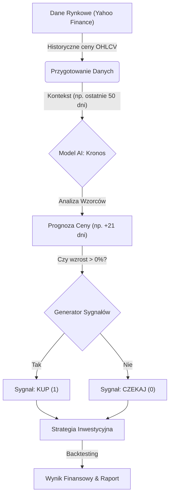

# Raport Projektowy: Wykorzystanie Modelu Kronos w Prognozowaniu ETF
**Temat:** Finanse i inwestowanie – analiza szeregów czasowych funduszu QQQ.
**Obszar projektu:** Analiza danych biznesowych i rynki kapitałowe.

---

## CZĘŚĆ I: Poradnik Inwestora – Jak AI wspiera decyzje?
*Celem tej części jest przystępne przedstawienie wybranego problemu dla odbiorcy nietechnicznego. Sekcja została opracowana z wykorzystaniem narzędzi generatywnej SI.*

### 1. Wstęp: Nowa Era Inwestowania Aktywnego
W świecie finansów przewaga informacyjna jest kluczem do sukcesu. Tradycyjne metody analizy technicznej (oparte na wskaźnikach takich jak średnie kroczące czy RSI) często zawodzą w obliczu złożoności i zmienności współczesnych rynków. Tutaj z pomocą przychodzi **Sztuczna Inteligencja (AI)**, a w szczególności jej najnowsza odsłona – **Modele Fundacyjne**.

Niniejszy raport opisuje projekt wykorzystujący model **Kronos** – zaawansowane narzędzie AI zaprojektowane do analizy szeregów czasowych (takich jak ceny akcji czy ETF-ów), którego celem jest wspieranie aktywnego inwestora w podejmowaniu lepszych decyzji.

### 2. Czym są Modele Fundacyjne w Finansach?
Aby zrozumieć innowacyjność tego podejścia, warto odnieść się do popularnych modeli językowych, takich jak ChatGPT.

*   **Modele Językowe (LLM):** Uczą się na ogromnych zbiorach tekstu (książki, internet), aby rozumieć gramatykę, kontekst i znaczenie słów. Dzięki temu potrafią pisać wiersze, tłumaczyć teksty czy odpowiadać na pytania.
*   **Time-Series Foundation Models (TSFM, np. Kronos):** Działają na podobnej zasadzie, ale zamiast słów "czytają" sekwencje liczb – historyczne ceny, wolumeny i inne dane rynkowe.

**Kluczowa różnica:** Zamiast uczyć się sztywnych reguł (np. "kupuj, gdy cena przetnie średnią"), TSFM uczy się **uniwersalnych wzorców** zachowań rynku na podstawie gigantycznej ilości danych historycznych. Model Kronos, na przykład, został wytrenowany na ponad **12 miliardach rekordów** (świec) z 45 globalnych giełd. Dzięki temu potrafi dostrzec subtelne zależności niewidoczne dla ludzkiego oka oraz prognozować zachowanie aktywów, których nigdy wcześniej nie widział (tzw. *zero-shot forecasting*).

### 3. Dlaczego warto? (Korzyści)
Zastosowanie modeli fundacyjnych w inwestowaniu oferuje kilka kluczowych przewag:

1.  **Obiektywizm:** AI nie kieruje się emocjami (strachem czy chciwością), które są głównym wrogiem inwestora.
2.  **Głębia Analizy:** Model potrafi analizować nieliniowe zależności, które są zbyt skomplikowane dla tradycyjnych wskaźników.
3.  **Adaptacyjność:** Dzięki wstępnemu treningowi na ogromnych zbiorach danych, model lepiej radzi sobie w nowych, nieznanych warunkach rynkowych (tzw. *zero-shot forecasting*).

### 4. Metodyka: Zastosowanie Prompt Engineering
Niniejszy raport został przygotowany przy współpracy z asystentem AI, wykorzystując techniki **Prompt Engineering** w celu zapewnienia jasności i dopasowania do odbiorcy. Poniżej przedstawiono przykłady promptów użytych do wygenerowania treści:

**Przykład 1: Generowanie prostego wyjaśnienia technologii**
> **Prompt:** "Jesteś ekspertem finansowym specjalizującym się w AI. Wyjaśnij inwestorowi, który zna podstawy giełdy, czym są 'Modele Fundacyjne dla Szeregów Czasowych' (Time-Series Foundation Models). Użyj analogii do ChatGPT, aby pokazać różnicę między tradycyjnym algorytmem a modelem uczącym się wzorców. Język ma być prosty, polski i zachęcający."

**Przykład 2: Interpretacja wyników backtestingu**
> **Prompt:** "Na podstawie wyników backtestingu QQQ (+21% zysku, -10% drawdown), sformułuj wnioski dotyczące bezpieczeństwa kapitału. Skup się na porównaniu ze strategią pasywną."

**Przykład 3: Opis procesu decyzyjnego**
> **Prompt:** "Na podstawie załączonego kodu (predictor.py), opisz krok po kroku, jak system podejmuje decyzję. Skup się na przepływie: Dane -> Model -> Prognoza -> Sygnał. Nie używaj żargonu programistycznego, zamiast tego używaj pojęć biznesowych."

---

## CZĘŚĆ II: Opracowanie konkretnego przypadku (Analiza danych i ML)
*Praktyczne rozwiązanie problemu z użyciem metod uczenia maszynowego (szeregi czasowe) na rzeczywistych danych funduszu Invesco QQQ Trust.*

### 1. Analiza Projektu: Jak działa Twój Asystent Inwestycyjny?
Nasz system inwestycyjny opiera się na trzech filarach: **Danych**, **Inteligencji (Model Kronos)** oraz **Strategii**.

#### Dane wejściowe (Paliwo)
System pobiera dane rynkowe dla wybranego funduszu ETF (np. ceny otwarcia, zamknięcia, najwyższe, najniższe oraz wolumen). Dane te są "oknem na świat" dla modelu – zazwyczaj analizuje on ostatnie ~50 dni (tzw. *lookback context*), aby zrozumieć bieżącą sytuację.

#### Inteligentna Prognoza (Silnik)
Sercem systemu jest model **Kronos**.
*   Model otrzymuje sekwencję ostatnich cen.
*   Przetwarza je przez sieć neuronową, szukając analogii do milionów sytuacji rynkowych, które widział podczas treningu.
*   **Wynik:** Generuje prognozę ceny zamknięcia na przyszłość (np. za 21 dni).

#### Decyzja Inwestycyjna (Strategia)
Sama prognoza to nie wszystko. System przekształca ją w konkretny sygnał handlowy:
*   Jeśli model przewiduje wzrost ceny powyżej określonego progu -> **Sygnał KUPNA (1)**.
*   W przeciwnym wypadku -> **Sygnał NEUTRALNY/SPRZEDAŻY (0)**.

### 2. Wizualizacja Procesu
Poniższy diagram obrazuje przepływ informacji w systemie:

### 3. Studium Przypadku: Analiza QQQ (2024-2025)
Aby zweryfikować skuteczność systemu, przeprowadzono test na historycznych danych funduszu **QQQ** (Invesco QQQ Trust), śledzącego indeks NASDAQ-100. Poniżej przedstawiamy wyniki symulacji za okres **Marzec 2024 – Grudzień 2025**.

#### Wynik Finansowy vs Strategia Pasywna
Najważniejszym pytaniem dla inwestora jest: "Czy pobiłem rynek?". Porównajmy naszą aktywną strategię AI ze strategią "Kup i Trzymaj" (Buy & Hold).

| Metryka | Strategia Aktywna (AI) | Strategia Pasywna (Buy & Hold) |
| :--- | :--- | :--- |
| **Całkowity Zwrot** | **+21.17%** | **+39.38%** |
| **Liczba Transakcji** | 114 | 1 |
| **Ekspozycja na Rynek** | 70.93% | 100% |

**Wniosek:** W analizowanym okresie, charakteryzującym się silnym trendem wzrostowym, strategia pasywna przyniosła wyższy zysk. Model AI, próbując "wyczuć rynek", spędził blisko 30% czasu poza rynkiem (gotówka), co uchroniło kapitał przed zmiennością, ale też ograniczyło udział w silnych wzrostach.

#### Analiza Ryzyka i Stabilności
Zysk to nie wszystko – liczy się bezpieczeństwo. Spójrzmy na metryki ryzyka:

*   **Maksymalne Obsunięcie Kapitału (Max Drawdown): -10.24%**
    *   *Interpretacja:* W najgorszym momencie inwestor straciłby tymczasowo tylko ok. 10% wartości portfela od szczytu. Dla porównania, indeksy technologiczne potrafią spadać znacznie głębiej. Niska wartość Drawdown świadczy o dobrym zarządzaniu ryzykiem przez AI.
*   **Wskaźnik Sharpe'a (Sharpe Ratio): 0.69**
    *   *Interpretacja:* Miarą opłacalności podejmowanego ryzyka. Wartość ta wskazuje na akceptowalny stosunek zysku do ryzyka.
*   **Skuteczność (Win Rate): 56.14%**
    *   *Interpretacja:* Ponad połowa transakcji zakończyła się zyskiem. Kluczem jest to, aby zyski z udanych transakcji przewyższały straty z nieudanych.

---

## PODSUMOWANIE I WNIOSKI
Projekt prezentuje praktyczne zastosowanie umiejętności nabytych podczas zajęć: wykorzystanie generatywnej AI, prompt engineeringu oraz analizy szeregów czasowych.

1.  **AI jako "Bezpiecznik":** Sztuczna Inteligencja w inwestowaniu pełni rolę stabilizatora – pozwala na wzrost kapitału przy ograniczonym ryzyku spadku (co widać po niskim Max Drawdown).
2.  **Ograniczenia:** W silnym trendzie wzrostowym (hossa) trudno pobić prostą strategię "Kup i Trzymaj", jednak AI oferuje lepszą ochronę w momentach niepewności.
3.  **Dalszy rozwój:** Wzbogacenie modelu o analizę sentymentu (newsy rynkowe) oraz testowanie na innych klasach aktywów (kryptowaluty, surowce) mogłoby poprawić wyniki w okresach silnych trendów.
